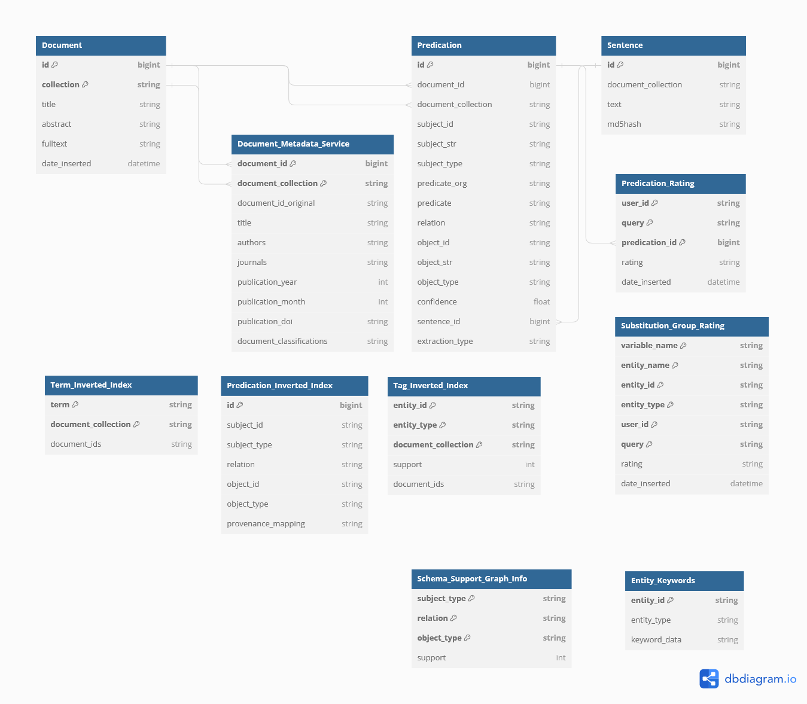

# Narrative Service
Caution: This project includes research software and is still in development.
The project is mainly used for research.

It covers:
- The [narrative service](https://www.narrative.pubpharm.de) 
- Research/evaluation/brain storming scripts in the [analysis package](src/narraint/analysis)

It requires two subprojects:
- [Narrative Annotation](https://github.com/HermannKroll/NarrativeAnnotation): Pharmaceutical entity linking, entity handling, entity resolving (name to id)
- [KGExtractionToolbox](https://github.com/HermannKroll/KGExtractionToolbox): Basic entity linking methods / information extraction / pipelines for automatisation

We configured the Narrative Service on Ubuntu LTS 22.04. 
The following documentation for shell commands and path is designed for Ubuntu.


The project does not need root privileges. 
So for running the service, create a dedicated user, e.g., pubpharm on your server. 
```
adduser pubpharm
su pubpharm
```


To use this project, clone this project and its submodules via:
```
git clone --recurse-submodules git@github.com:HermannKroll/NarrativeIntelligence.git
```


For development purposes, dev should be cloned:
```
git clone --recurse-submodules --branch dev git@github.com:HermannKroll/NarrativeIntelligence.git
```

## Cloning a private repository
When cloning a private repository of GitHub, you need to create private public key pair for your account.
```
ssh-keygen
```
Put the public key into your GitHub account which was granted access to this repository. 

# Database Setup
The narrative service requires a Postgres database that contains processed documents. 
So first please setup a Postgres database by following the official instructions. 
We used V14. 

## Configure Postgres

```
sudo nano /etc/postgresql/14/main
```

Change the following settings. 
More memory is better.
```
shared_buffers = 10GB	
work_mem = 2GB			
```

Restart Postgres Server.
```
sudo systemctl restart postgresql
```

## Configure fidpharmazie database

Create a new postgres database. 
Log in first.
```
psql -h localhost -U postgres -W
```

Create the database.
```
CREATE DATABASE fidpharmazie;
```


Edit the following file
```
nano /etc/postgresql/14/main/pg_hba.conf
```
by adding the line
``` 
host    fidpharmazie    all             127.0.0.1/32            md5
```
This line allows accessing the database from localhost. 

Now restore the database dump
``` 
pg_restore -h 127.0.0.1 -O -U postgres -W -d fidpharmazie fidpharmazie_2023_06_12.dump
``` 

After the database has been restored, we need to create an user for the database. 
Login into the database as the postgres user.
```
psql -h localhost -U postgres -W -d fidpharmazie
```
Create user for the service.
Please replace EXAMPLE_PW by a real password.
```
CREATE USER servicero WITH PASSWORD 'EXAMPLE_PW';
```

Now grant all required rights.
```
GRANT SELECT ON ALL TABLES IN SCHEMA public TO servicero;
GRANT INSERT ON TABLE public.PREDICATION_RATING TO servicero;
GRANT INSERT ON TABLE public.SUBSTITUTION_GROUP_RATING TO servicero;
```
Ratings must be inserted. For all other tables, read access is sufficient for the service to run. 

### Backup the Database
The database can be backuped via the following command:
```
pg_dump  -h 127.0.0.1 -O -U postgres -W -d fidpharmazie --format custom  --file fidpharmazie_2023_06_12.dump
```

# Narrative Service Setup
The narrative service is written in Python. 
We need to create a suitable interpreter first.

## Create a virtual environment

### Install Anaconda
Make sure that conda (with Python 3 support) is installed.
If not, install it via:

```
curl https://repo.anaconda.com/archive/Anaconda3-2021.11-Linux-x86_64.sh --output anaconda.sh
bash anaconda.sh
```

It is a good idea to perform conda init, so that conda commands are available in your shell. 
By default, anaconda will be installed to
```
/home/pubpharm/anaconda3
```

If you did not run conda init, then run:
```
eval "$(/home/pubpharm/anaconda3/bin/conda shell.bash hook)"
conda init
```

### Environment Setup
We tested and used Python 3.8 and Conda. 
```
conda create -n narraint python=3.8
```

Activate the environment
```
conda activate narraint
```

## Getting Started
Switch to repository.
```
cd ~/NarrativeIntelligence/
```

Make sure that gcc is installed. 
```
sudo apt-get install gcc python3-dev
```

Install all Python requirements:
```
pip install -r requirements.txt
```


## Download Additional Data
Download the latest (currently 2022) MeSH Descriptor file. 
```
cd lib/NarrativeAnnotation/
bash download_data.sh
cd ../../
```


## Configuration
*All* configuration lives inside the `config` directory. 
The `*.example.json` files show the structure of the corresponding configuration file. 
Copy the example file and remove the `.example` from the filename.
To run the service, only backend.json is required. 
The database can be configured with the file ``backend.json`` and using environment variables. 
The environment variables are favoured over the `json`-configuration. 

```
cd ~/NarrativeIntelligence/config
cp backend.prod.json backend.json
nano backend.json
```

Next, configure your database connection in ``backend.json``:
```
{
  "use_SQLite": false,
  "SQLite_path": "sqlitebase.db",
  "POSTGRES_DB": "fidpharmazie",
  "POSTGRES_HOST": "127.0.0.1",
  "POSTGRES_PORT": "5432",
  "POSTGRES_USER": "servicero",
  "POSTGRES_PW": "EXAMPLE_PW",
  "POSTGRES_SCHEMA": "public"
}
```
Save and exit.

## Python Path
Make always be sure that if you run any of our scripts, you activated your conda environment and set the Python Path.
```
conda activate narraint
export PYTHONPATH="/home/pubpharm/NarrativeIntelligence/src/:/home/pubpharm/NarrativeIntelligence/lib/NarrativeAnnotation/src/:/home/pubpharm/NarrativeIntelligence/lib/KGExtractionToolbox/src/"
```

Switch to repository.
```
cd ~/NarrativeIntelligence/
```

## Setup NLP 
Execute NLTK stuff.
```
python src/narraint/nltk_setup.py
```

## Build Required indexes 
We require two working indexes for several scripts:
The first script will build all necessary indexes (tagging, entity translation and services indexes). 
Make sure, that you are connected to the fidpharmazie database.
```
python src/narraint/build_all_indexes.py
```
This may take a while.


# Web Server Deployment
The project builds upon Django which uses gunicorn as a local web server. 
However, gunicorn should not be used as a live web service. 
That is why a reverse proxy should be used to serve the static data and forward request to the local gunicorn. 


## Deploy a reverse proxy
We used nginx. 
Please install nginx.
```
apt-get install nginx
```

First, create a static www directory to store all static web files:
```
sudo mkdir /var/www/static
sudo chgrp -R www-data /var/www 
sudo chmod -R 775 /var/www
```

Configure it via:
```
sudo nano /etc/nginx/nginx.conf
```

We used the following configuration:
- Gzip is required to shrink down large results
- HTTP is forwarded to HTTPS
- Proxy Headers are set to that gunicorn accepts the forwarded messages.
- We assume that gunicorn and Django will run on port 8080. This port must NOT be reachable from outside. 
```
user www-data;
worker_processes auto;
pid /run/nginx.pid;
include /etc/nginx/modules-enabled/*.conf;

events {
        worker_connections 768;
        #multi_accept on;
}

http {
    sendfile on;

    gzip              on;
    gzip_http_version 1.0;
    gzip_proxied      any;
    gzip_min_length   500;
    gzip_disable      "MSIE [1-6]\.";
    gzip_types        text/plain text/xml text/css
                      text/comma-separated-values
                      text/javascript
                      application/x-javascript
                      application/atom+xml;


    proxy_connect_timeout       600;
    proxy_send_timeout          600;
    proxy_read_timeout          600;
    send_timeout                600;

    # Configuration for Nginx
    server {
        listen 80;
        server_name www.narrative.pubpharm.de;
        return 301 https://narrative.pubpharm.de$request_uri;
    }
    
    # Redirect every www* response because our certificate has no wildcard
    server {
        server_name www.narrative.pubpharm.de;
        listen 443 ssl;

                ssl_certificate  /etc/nginx/narrative.pubpharm.de.pem;
        ssl_certificate_key /etc/nginx/narrative.pubpharm.de.key;
        ssl_protocols       TLSv1 TLSv1.1 TLSv1.2;
        ssl_ciphers         HIGH:!aNULL:!MD5;

        return 301 https://narrative.pubpharm.de$request_uri;
    }

    server {
        # Running port
        listen 443 ssl;
        server_name www.narrative.pubpharm.de;
        ssl_certificate  /etc/nginx/narrative.pubpharm.de.pem;
        ssl_certificate_key /etc/nginx/narrative.pubpharm.de.key;
        ssl_protocols       TLSv1 TLSv1.1 TLSv1.2;
        ssl_ciphers         HIGH:!aNULL:!MD5;

        # Settings to serve static files 
        location ~ ^/static/  {
            include  /etc/nginx/mime.types;
            root /var/www/;
        }

        # Proxy connections to the application servers
        # app_servers
        location / {
            proxy_pass         http://127.0.0.1:8080;
            proxy_set_header   X-Real-IP $remote_addr;
            proxy_set_header   X-Forwarded-For $proxy_add_x_forwarded_for;
            proxy_set_header   X-Forwarded-Host $server_name;
            proxy_set_header X-Forwarded-Proto $scheme;
            add_header Front-End-Https on;
         
        }
    }
}
```
For SSL, we copied certificate and private key to
```
/etc/nginx/narrative.pubpharm.de.pem
/etc/nginx/narrative.pubpharm.de.key
```

After configuring nginx, please restart it via:
```
sudo service nginx restart 
```

## Setup Django and gunicorn

Switch into a screen session for the following commands.
```
screen
```
or get your screen back
```
screen -ar
```

Make always be sure that if you run any of our scripts, you activated your conda environment and set the Python Path.
```
conda activate narraint
export PYTHONPATH="/home/pubpharm/NarrativeIntelligence/src/:/home/pubpharm/NarrativeIntelligence/lib/NarrativeAnnotation/src/:/home/pubpharm/NarrativeIntelligence/lib/KGExtractionToolbox/src/"
```

The productive settings must be set for Django via:
```
export DJANGO_SETTINGS_MODULE="frontend.settings.prod"
```

Next, copy all static web data to the reverse proxy. 
Therefore, run the following lines:
```
sudo chmod -R 777 /var/www
python ~/NarrativeIntelligence/src/narraint/frontend/manage.py collectstatic
sudo chmod -R 775 /var/www	 
```
The script will inform you how many files are going to be changed. 
Accept the changes with 'y'.

## Run Django and gunicorn
```
cd ~/NarrativeIntelligence/src/narraint/frontend/

gunicorn -b 127.0.0.1:8080 --timeout 500 frontend.wsgi -w 4 --preload 2> ~/run_2023_06_X.txt
```

At the moment, logging is done on console. 
That is why we redirect the output to a file.
- w specifies the number of parallel worker (each one consumes about 2GB of RAM)
- preload forces that all indexes are load before spawning the workers
- timeout specifies when a long request will be stopped and the corresponding worker is rebooted


# Updating the Service 
Switch to screen session and stop service.
Then pull updates from GitHub.
Note that we have to update three repositories.
```
cd ~/NarrativeIntelligence/
git pull --recurse-submodules
```

Collect changes and update static www data.
```
cd ~/NarrativeIntelligence/src/narraint/frontend/
sudo chmod -R 777 /var/www
python manage.py collectstatic
sudo chmod -R 775 /var/www	  
```

Start the service again.


# Export User Ratings and Log Files
First export ratings from the database. 
Make sure that the virtual environment narraint is activated and that your Python path is configured properly. 
```
python ~/NarrativeIntelligence/src/narraint/backend/export_predication_ratings.py ~/ratings_2023_10_16.json
python ~/NarrativeIntelligence/src/narraint/backend/export_subgroup_ratings.py ~/subgroup_ratings_2023_10_16.json
```

Next zip log files + ratings:
```
cd ~
zip -r logs_2023_10_16.zip subgroup_ratings_* run_* ratings* NarrativeIntelligence/logs/* NarrativeIntelligence/reports/* *.json
```

Connect via an SFTP client or download the zip via scp. 


# Data Mining (Update Service Data)


# Development


## Project structure
The projects core, the `narraint` package, consists of several Python packages and modules with do a certain job:

| Package       | Task                                                                                          |
|---------------|-----------------------------------------------------------------------------------------------|
| `analysis`    | Python scripts to compute database statistics and research stuff                              |
| `backend`     | Connection to database, loading and exporting                                                 |
| `frontend`    | Narrative Service Web Service                                                                 |
| `queryengine` | Engine to match graph queries (basic graph patterns) to our database facts (retrieval)        


## Setting up the Test Suite
Just execute src/nitests folder via pytests.

## SSH Server Interpreter
Check out the latest version of the project. 
Next open the project in PyCharm.
Next, configure the SSH Interpreter in PyCharm. 
Python Interpreter can be found in the local conda directory (.conda/...)


## General Database Schema


## Narrative Service Database Schema


