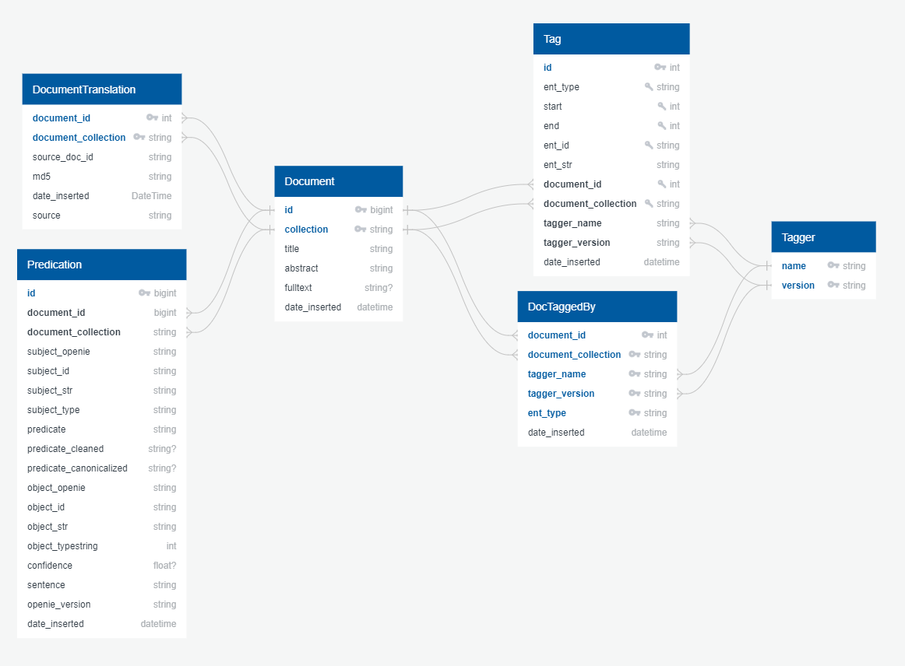

# Narrative Intelligence

This project can be used to process documents using Narratives.

## Getting Started
Download the latest (currently 2020) MeSH Descriptor file. Then install the required Python packages. We recommend you to use Python 3.6 or higher.

```
./download_data.sh
pip install -r requirements.txt
```

### Additional Shared Resource Directory
We have a shared Cloud Space: [OneDrive](https://1drv.ms/u/s!ArDgbq3ak3Zuh5oNxxBPfJSqqpB2cw?e=iMfQKR). Password: youshallnotpass


### Data directory
The ``data`` directory contains application data for **all** packages.
Application data should **never** be stored inside the project models.
Application data includes:
- MESH descriptor files
- UMLS data
- TIB EPA dump


| Name | Description | Path on IS69 | 
| ------ | ------ | ------ | 
| PMC | PubMedCentral Fulltext XML Dump | /hdd2/datasets/pubmed_central/ |
| PubMed | Tagged PubMed Abstracts & Titles and Tagged PMC Fulltexts (but does not include the fulltexts) | /hdd2/datasets/pubtator_central/2019_11/ bioconcepts2pubtatorcentral.offset |
| TIB | Patents | /hdd2/datasets/patents_tib_metadata/2019_06/ tib_epa_ifis.txt |
| WHO | WHO Database of covid19 Articles | /hdd2/datasets/covid19/who/ |
| BIORXIV | biorxiv articles related to covid19 | /hdd2/datasets/covid19/who/ |

### Configuration
*All* configuration lives inside the `config` directory. The `*.example.json` files show the structure of the corresponding configuration file. Copy the example file and remove the `.example` from the filename. Note, the configuration files are referenced by the module `narraint.config`, so you shouldn't rename them.

The database can be configure with the file ``backend.json`` and using environment variables. The environment variables
are favoured over the `json`-configuration. 

| Name | Function |
| ------ | ------ |
| `NI_POSTGRES_USER` | Username |
| `NI_POSTGRES_PW` | Password |
| `NI_POSTGRES_HOST` | Host |
| `NI_POSTGRES_POST` | Port number |
| `NI_POSTGRES_DB` | Database name |


## Project structure
The projects core, the `narraint` package, consists of several Python packages and modules with do a certain job:

| Package | Task |
|-----------------|-----------------------------------------------------------------------------------------------|
| `analysis` | Python scripts to compute database statistics |
| `backend` | Connection to database, loading and exporting |
| `enitity` | Entity stuff like mapping entity ids to vocabulary headings|
| `frontend` | Webserver the the user interface for querying with Narratives (FID Pharmazie) |
| `graph` | Model for a labeled directed graph with useful tools (computing connectivity components, export to dot, etc) |
| `lucence` | Scripts to Wrap Apache Lucene's functions
| `mesh` | MeSH database wrapper, provides several functions to work on the MeSH tree |
| `narrative` | Implementation of the Narrative querying |
| `openie` | OpenIE for PubTator documents using Standford NLP |
| `preprocessing` | Conversion and Named Entity Recognition on PubTator documents |
| `pubmedutils` | Tools to query PMIDs from PubMed and PubTator files from Pubtator  |
| `pubtator` | Wrapper classes for PubTator documents as well as useful functionality for PubTator documents |
| `queryengine` | Engine to match graph queries (basic graph patterns) to our database facts (extracted by openie)  |
| `semmeddb` | Connection Handling for a SemMedDB. Currently our prototype queries SemMedDB via this package for fact retrieval |
| `stories` | Some experimental stuff to derive stories from documents |
| `utils` | Several nice helper scripts | 

## Named Entity Recognition

To perform Named Entity Recognition of documents use the `preprocessing` package. The documents must first be converted to the PubTator format ([example file](https://www.ncbi.nlm.nih.gov/research/pubtator-api/publications/export/pubtator?pmids=19894120)). Please note that the PubTator format is the central unit for this project and that all tools work with this format.

The entry point `preprocess.py` takes a directory of PubTator files and generates a single file with all documents and tags.
The documents and tags are all inserted into the database for later processing and retrieval.

Currently, the following entity types can be detected:
- Chemicals
- Diseases
- Genes
- Species
- Dosage Forms

The package provides APIs for several third-party taggers:

| Tagger | Entity types |
|-------------------|-------------------|
| TaggerOne (0.2.1) | Chemical, Disease |
| GNormPlus | Gene, Species |
| DNorm | Disease |
| tmChem | Chemical |
| DosageFormTagger (own) | DosageForm

 Known Issue: The tmchem subprocess doesn't terminate automatically. Therefore, it is checked if all output files 
 have been created and if the last line in the logfile is 'Waiting for input'. If both applies, the subprocess is
 terminated. This is quite fragile and will break if tmchems logging or behaviour should ever change.

## Database scheme


created with app.quickdatabasediagrams.com


## Meeting Protocols
- [2020_04_24](meetings/2020_04_24.md)
- [2020_04_16](meetings/2020_04_16.md)
- [2020_04_07](meetings/2020_04_07.md)
- [2020_03_31](meetings/2020_03_31.md)
- [2020_03_25](meetings/2020_03_25.md)
- [2020_03_19](meetings/2020_03_19.md)

## Docker
The preprocessing-pipeline can be used as Docker container.
To build the container, switch inside the `docker` subdirectory and run
`./deploy.sh` The script will download the required taggers and copy the TaggerOne models
into the directory due to Docker internals.

The script creates a file called `narraint-deploy.tar.gz` inside the `build` directory.
This file contains the compressed Docker image, the README and the docker-compose file.

## Lucene
To setup lucene see [lucene readme](narraint/lucene/README.md)